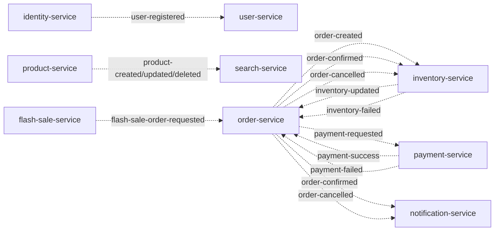
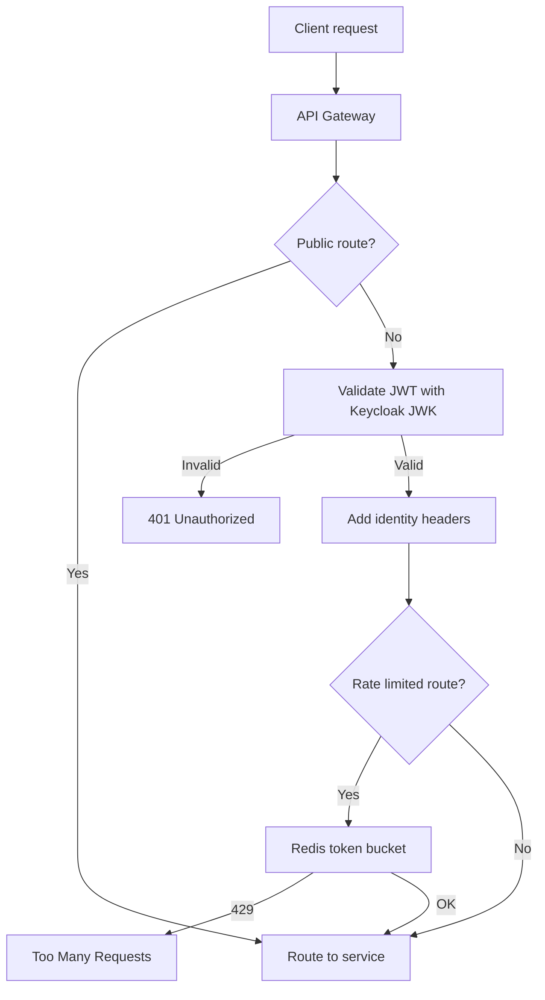
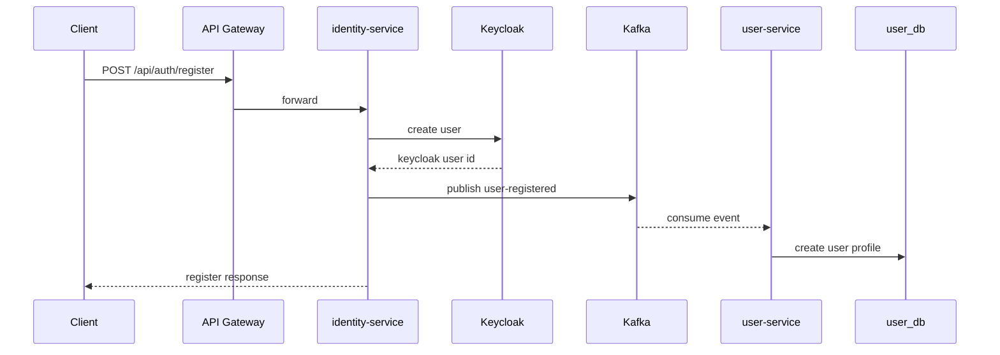
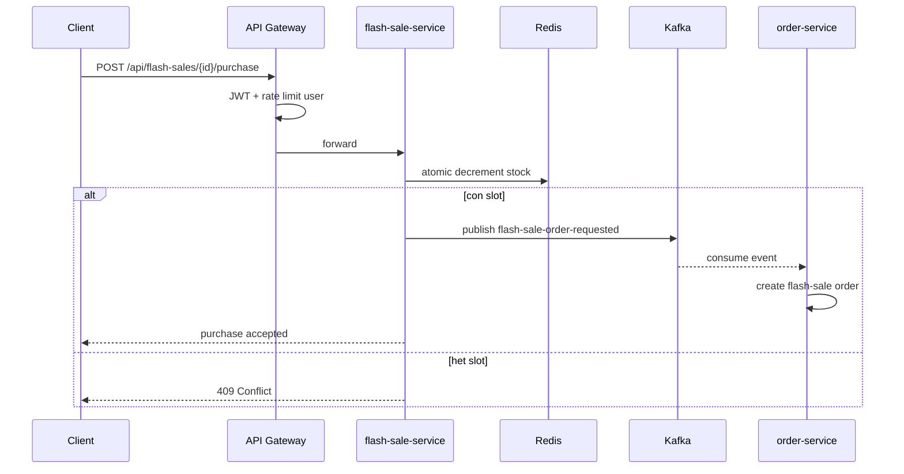
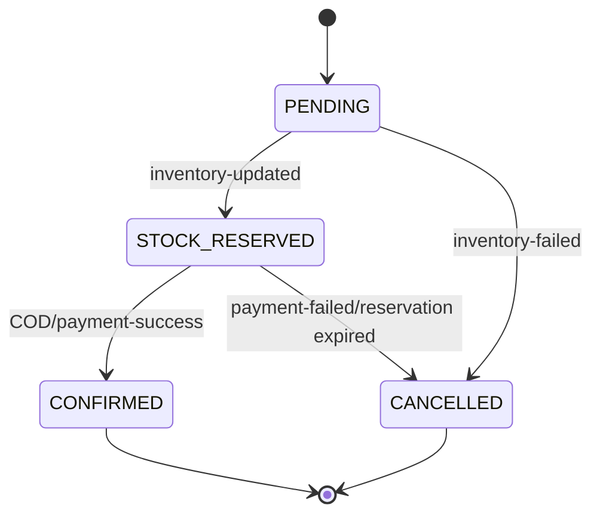
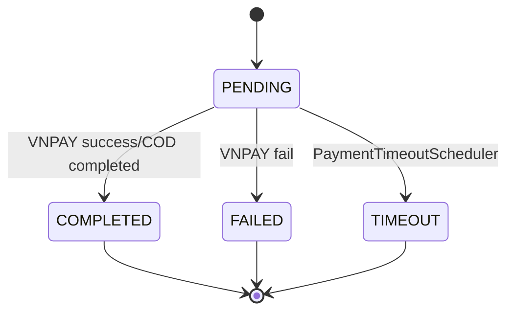
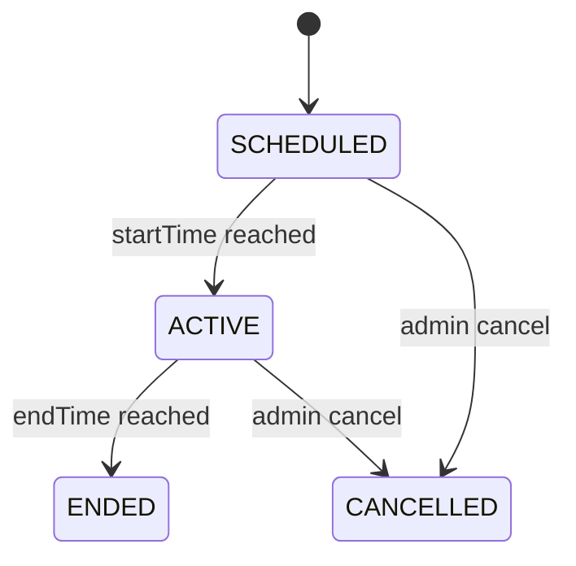

# Huong dan ve so do cho bao cao DATN

Tai lieu nay bo sung cho `.docs/07-danh-muc-so-do-bang-bieu.md`. Muc tieu la giup ve dung nhung hinh can thiet, khop voi code hien tai, khong ve thieu thanh phan quan trong cua he thong.

## 1. Quy uoc chung khi ve

Nen dung draw.io cho hinh dua vao Word/PDF, Mermaid cho ban nhap nhanh trong Markdown, DBeaver/DataGrip cho ERD.

Quy uoc mau de thong nhat:

| Nhom | Mau goi y | Vi du |
|---|---|---|
| Client/External | Xanh nhat | Browser, Postman, VNPAY |
| Gateway/Spring Cloud | Tim nhat | API Gateway, Eureka, Config Server |
| Business service | Xanh la nhat | order-service, product-service |
| Data/infra | Vang/xam | PostgreSQL, Redis, Kafka, Elasticsearch |
| Async event | Mui ten dut net | Kafka topic |
| Sync REST/Feign | Mui ten lien net | Gateway route, Feign call |
| Scheduler/background | Cam | OutboxPoller, CampaignScheduler |

Nguyen tac:

1. Khong ve tat ca moi thu vao mot hinh duy nhat. Hinh tong the chi can thanh phan chinh; chi tiet tach sang sequence/ERD/state.
2. Tat ca so do can co caption dang: `Hinh 4.x. Ten hinh - Nguon: ...`.
3. Ten service phai trung voi code: `api-gateway`, `order-service`, `payment-service`, ...
4. Dung mui ten lien net cho REST/Feign, mui ten dut net cho Kafka.
5. Neu hinh qua rong, chia theo domain: order saga, product-search, flash sale, security.

## 2. Bo hinh bat buoc nen ve

Neu thoi gian han che, uu tien bo hinh nay truoc:

| Ma | Hinh | Cong cu | Nguon chinh |
|---|---|---|---|
| H4.1 | Use Case tong the | PlantUML/draw.io | `*Controller.java`, `.guide/09-luong-nghiep-vu.md` |
| H4.2 | Component diagram 4 lop | draw.io | `docker-compose.yml`, `pom.xml` |
| H4.3 | Context map 13 service | draw.io | `.docs/04-chuong-4...`, `pom.xml` |
| H4.4 | REST/Feign dependency graph | Mermaid/draw.io | cac `@FeignClient` |
| H4.5 | Kafka topic flow | Mermaid/draw.io | `.guide/12-kafka-topics.md`, `*Consumer.java`, `*Producer.java` |
| H4.6 | Gateway routing/security | Mermaid/draw.io | `config-server/.../api-gateway.yml`, `.guide/15-gateway-security.md` |
| H4.7-H4.16 | ERD tung service | DBeaver/draw.io | cac file `db/migration/*.sql` |
| H4.19-H4.24 | Sequence nghiep vu chinh | Mermaid/PlantUML | `.guide/09-luong-nghiep-vu.md` |
| H4.25-H4.27 | State machine | Mermaid | `.guide/13-state-machines.md` |
| H5.1 | Maven multi-module structure | draw.io | `pom.xml` |
| H5.2 | Docker Compose deployment | draw.io | `docker-compose.yml` |
| H6.1 | Performance/test setup | draw.io | `.docs/06-chuong-6...` |

## 3. Cach ve tung nhom so do

### 3.1. Use Case tong the

Dat 5 actor o ngoai system boundary:

- `Guest`: xem san pham, tim kiem, xem banner/blog, thao tac gio hang guest.
- `Customer`: dang nhap, quan ly profile/dia chi, dat hang, thanh toan, mua flash sale, danh gia san pham.
- `Admin`: quan ly product/category/brand, inventory, voucher, content, flash-sale campaign.
- `VNPAY`: nhan request thanh toan, goi return/IPN.
- `Scheduler`: het han reservation, timeout payment, chuyen trang thai campaign, publish outbox.

Trong boundary ghi `E-commerce Microservices System`. Gom use case thanh 6 cum:

| Cum | Use case nen dua vao |
|---|---|
| Auth/User | register, login, refresh token, manage profile, manage addresses |
| Catalog/Search | list products, product detail, search, suggestions |
| Cart/Order | manage cart, place order, view order, track status |
| Payment/Saga | create VNPAY URL, process IPN/return, confirm/cancel order |
| Admin | manage product, inventory, voucher, content, flash sale |
| Social/Notification | review product, receive email |

Meo ve: khong noi moi use case voi moi actor neu qua roi. Noi actor vao cum chuc nang lon, sau do trong report mo ta bang chi tiet.

### 3.2. Component diagram 4 lop

Ve tu tren xuong duoi:

1. Lop Client: `Browser/Frontend`, `Postman`, `VNPAY`.
2. Lop Edge/Spring Cloud: `API Gateway :8080`, `Eureka :8761`, `Config Server :8888`, `Keycloak :8180`.
3. Lop Business services: 13 service nghiep vu.
4. Lop Infrastructure: PostgreSQL, Redis, Kafka, Elasticsearch, Mailpit, Prometheus, Grafana, Zipkin.

Mui ten chinh:

- Client -> API Gateway.
- API Gateway -> cac service qua route `/api/**`.
- Service -> Config Server de lay config.
- Service -> Eureka de dang ky/discover.
- Service -> PostgreSQL/Redis/Elasticsearch theo ownership.
- Service <--> Kafka bang event.
- Service -> Zipkin/Prometheus cho tracing/metrics.

Danh sach business service:

`identity`, `user`, `product`, `inventory`, `cart`, `order`, `payment`, `voucher`, `notification`, `review`, `search`, `content`, `flash-sale`.

### 3.3. Context map 13 service

Day la hinh quan trong de giai thich tach microservices. Ve moi service la mot bounded context, ghi ngan gon ownership ben trong box:

| Service | Ownership |
|---|---|
| identity-service | Auth facade, Keycloak integration |
| user-service | Profile, delivery address |
| product-service | Product, category, brand |
| inventory-service | Stock, reservation |
| cart-service | Cart in Redis |
| order-service | Order saga orchestrator |
| payment-service | COD/VNPAY payment |
| voucher-service | Voucher, reservation, usage |
| notification-service | Email notification |
| review-service | Review, rating |
| search-service | Elasticsearch read model |
| content-service | Banner, blog post |
| flash-sale-service | Campaign, Redis atomic slot |

Quan he nen noi:

- `order-service` -> `product-service`, `voucher-service`, `cart-service` bang REST/Feign.
- `payment-service` -> `order-service` bang REST/Feign de lay payment context.
- `review-service` -> `order-service` de check da mua hang.
- `cart-service` -> `product-service` de validate san pham.
- `flash-sale-service` -> `order-service` de dem order flash-sale.
- Kafka: identity -> user, product -> search, order/inventory/payment/notification trong saga.

### 3.4. REST/Feign dependency graph

Dung hinh rieng de tranh roi voi Kafka.

```mermaid
flowchart LR
    Cart[cart-service] -->|Feign GET /api/products/{id}| Product[product-service]
    Order[order-service] -->|Feign GET /api/products/{id}| Product
    Order -->|Feign reserve/commit/release voucher| Voucher[voucher-service]
    Order -->|Feign DELETE /internal/cart/{userId}| Cart
    Payment[payment-service] -->|Feign payment-context| Order
    Review[review-service] -->|Feign confirmed purchase| Order
    Flash[flash-sale-service] -->|Feign count-by-flash-sale| Order
```

Trong draw.io, dung mui ten lien net va label endpoint ngan gon.

### 3.5. Kafka topic flow tong the

Nen ve bang draw.io hoac Mermaid. Tach thanh 3 cum:

- User/product indexing.
- Order saga.
- Flash sale.



Ghi chu them trong hinh: `flash-sale-order-requested` co 3 partitions; cac DLT co dang `{topic}.DLT` khi consumer loi.

### 3.6. Gateway routing/security

Ve theo flow:

1. Client gui request den API Gateway.
2. Gateway check route public hay protected.
3. Neu protected: validate JWT voi Keycloak JWK.
4. Neu hop le: them `X-User-Id`, `X-User-Roles`, `X-User-Email`.
5. Rate limit voi Redis cho `/api/auth/**`, `/api/orders/**`, `/api/flash-sales/*/purchase`.
6. Forward toi service theo route.



Route source: `config-server/src/main/resources/configs/api-gateway.yml`.

### 3.7. ERD tung service

Khong ve mot ERD tong cho tat ca service vi microservices dung database-per-service. Ve rieng tung ERD:

| Service | Bang chinh | Quan he can ve |
|---|---|---|
| user-service | user_profiles, delivery_addresses, processed_events | user_profiles 1-n delivery_addresses |
| product-service | categories, brands, products, product_specifications, product_images | category 1-n products, brand 1-n products, product 1-n specs/images, category self parent |
| inventory-service | inventory, stock_movements, processed_events | noi logic qua `sku`, khong FK vat ly |
| order-service | orders, order_items, outbox, processed_events | orders 1-n order_items; outbox doc lap theo aggregate_id |
| payment-service | payments, payment_outbox, processed_events | payments doc lap theo order_id; payment_outbox theo aggregate_id |
| voucher-service | vouchers, voucher_reservations, voucher_usages | vouchers 1-n reservations/usages |
| notification-service | notifications, processed_events | event_id unique de idempotency |
| review-service | reviews | unique(user_id, product_id) |
| content-service | blog_posts, banners | doc lap |
| flash-sale-service | flash_sale_campaigns | doc lap; constraint sold_count <= quantity |

Cach lam nhanh bang DBeaver:

1. Chay Docker Compose de tao database.
2. Connect PostgreSQL `localhost:5432`.
3. Mo tung database/schema cua service.
4. Chon tables -> ER Diagram.
5. An cac cot audit neu hinh qua day: `created_at`, `updated_at`.
6. Export PNG/SVG, dat caption H4.7-H4.16.

Neu ve thu cong draw.io, moi bang chi can cot: PK, FK, cot nghiep vu, unique/constraint quan trong.

### 3.8. Redis key model

Ve nhu data model, khong phai ERD:

| Key | Service | Noi dung |
|---|---|---|
| `cart:{userId}` | cart-service | gio hang user da dang nhap |
| `cart:guest:{sessionId}` | cart-service | gio hang guest |
| product cache keys | product-service | cache product response |
| rate limiter keys | api-gateway | token bucket theo IP/user |
| `flash_sale:stock:{campaignId}` | flash-sale-service | so slot con lai |
| buyer set/key theo campaign | flash-sale-service | chong mua trung neu co ap dung |

Hinh nen co Redis o giua, cac service dung Redis o xung quanh: Gateway, cart, product, flash-sale.

### 3.9. Elasticsearch product document

Ve mot box `ProductDocument` co cac nhom field:

- Identity: `id`, `sku`.
- Search text: `name`, `description`, `brandName`, `categoryName`.
- Filter/sort: `price`, `isActive`, `createdAt`.
- Denormalized data: ten brand/category de search-service khong can query product DB.

Them flow nho: Admin CRUD product -> Kafka product event -> search-service -> Elasticsearch index.

### 3.10. Sequence dang ky user



Diem can ghi trong report: identity-service khong tu luu profile; user-service tao profile bat dong bo qua Kafka.

### 3.11. Sequence dat hang COD

Buoc ve:

1. Client -> Gateway -> order-service: `POST /api/orders`.
2. order-service -> product-service: validate product/price.
3. order-service -> voucher-service: reserve voucher neu co.
4. order-service -> order_db: tao order `PENDING`, luu outbox `ORDER_CREATED`.
5. OutboxPoller -> Kafka: `order-created`.
6. inventory-service reserve stock -> Kafka `inventory-updated`.
7. order-service nhan `inventory-updated`, set `STOCK_RESERVED`.
8. COD: order-service publish `payment-requested`.
9. payment-service tao payment `COMPLETED`, publish `payment-success`.
10. order-service set `CONFIRMED`, publish `order-confirmed`.
11. inventory-service confirm stock; notification-service gui email.

Nen dung activation box cho `order-service` vi day la saga orchestrator.

### 3.12. Sequence dat hang VNPAY

Giong COD den buoc `STOCK_RESERVED`, sau do tach:

1. Client -> payment-service: `POST /api/payments/vnpay/create`.
2. payment-service -> order-service: lay payment context.
3. payment-service tao payment `PENDING`, tra payment URL.
4. User thanh toan tren VNPAY.
5. VNPAY -> payment-service: return/IPN.
6. payment-service verify secure hash.
7. Thanh cong: publish `payment-success`; that bai/timeout: publish `payment-failed`.
8. order-service confirm/cancel va publish `order-confirmed` hoac `order-cancelled`.

Neu hinh qua dai, ve 2 hinh: `VNPAY success path` va `VNPAY failure/timeout path`.

### 3.13. Sequence cancel/compensation

Ve 3 nguon huy:

- `inventory-failed`: order-service set `CANCELLED`, release voucher neu co.
- `payment-failed`: order-service set `CANCELLED`, publish `order-cancelled`.
- `ReservationExpiryScheduler`: order-service huy order VNPAY qua han, publish `order-cancelled`.

Ket thuc flow:

- inventory-service consume `order-cancelled` -> release reserved stock.
- notification-service consume `order-cancelled` -> gui email.

### 3.14. Sequence flash sale purchase



Diem can lam noi bat: Redis atomic decrement ngan oversell; Kafka giup tao don bat dong bo.

### 3.15. State machine

Dung Mermaid stateDiagram cho 3 hinh rieng.

Order:



Payment:



Flash sale campaign:



### 3.16. Scheduler catalog

Bang B4.2 nen co:

| Scheduler | Service | Chu ky | Viec lam | Anh huong |
|---|---|---:|---|---|
| OutboxPoller | order-service | 1s | publish outbox event | dam bao event order khong mat |
| PaymentEventOutboxPoller | payment-service | 1s | publish payment outbox | dam bao event payment khong mat |
| ReservationExpiryScheduler | order-service | 60s | huy order VNPAY qua han | giai phong ton kho |
| PaymentTimeoutScheduler | payment-service | 60s | timeout payment pending | phat `payment-failed` |
| CampaignScheduler | flash-sale-service | 5s | SCHEDULED -> ACTIVE -> ENDED | seed Redis stock |
| ReconciliationScheduler | flash-sale-service | 300s | doi soat Redis/DB | sua lech slot/sold_count |

### 3.17. Docker Compose deployment

Ve thanh 4 vung trong cung network `ecommerce-network`:

1. Infrastructure: PostgreSQL, keycloak-db, Redis, Kafka, Elasticsearch, Mailpit.
2. Spring Cloud: Eureka, Config Server, API Gateway.
3. Business services: 13 service.
4. Observability: Prometheus, Grafana, Zipkin.

Ghi port public quan trong:

| Component | Port |
|---|---:|
| API Gateway | 8080 |
| Eureka | 8761 |
| Config Server | 8888 |
| Keycloak | 8180 |
| PostgreSQL | 5432 |
| Redis | 6379 |
| Kafka | 9092 |
| Elasticsearch | 9200 |
| Mailpit | 8025 |
| Prometheus | 9090 |
| Grafana | 3000 |
| Zipkin | 9411 |

### 3.18. Observability solution

Ve flow:

- Spring Boot Actuator exposes `/actuator/prometheus`.
- Prometheus scrape metrics tu services.
- Grafana doc Prometheus de hien dashboard.
- Services gui trace den Zipkin endpoint.
- Log xem qua Docker logs khi demo.

Khong can ve chi tiet tung metric; chi can giai thich 3 tru cot: metrics, tracing, logs.

## 4. Bang bieu nen co

| Bang | Noi dung | Nguon |
|---|---|---|
| B3.1 Tech stack va phien ban | Java 21, Spring Boot 3.5.13, Spring Cloud 2025.0.0, Kafka 8.2.0, PostgreSQL 17, Redis 8, Keycloak 26.6.1 | `pom.xml`, `docker-compose.yml` |
| B4.1 Service ownership | service, port, domain, persistence, communication | `.docs/04...`, `docker-compose.yml` |
| B4.2 Scheduler catalog | nhu muc 3.16 | `@Scheduled` classes |
| B4.3 Kafka topic catalog | topic, producer, consumer, purpose | `.guide/12-kafka-topics.md` |
| B4.4 API group | service, route group, public/auth/internal, role | `*Controller.java`, gateway config |
| B5.1 Source files quan trong | service, file, vai tro minh chung | codebase |
| B5.2 Docker service/port/healthcheck | container, port, healthcheck | `docker-compose.yml` |
| B6.x Test matrix | unit/integration/security/resilience/performance | test files, ket qua test |

## 5. Cach xuat hinh dua vao bao cao

1. Neu ve bang Mermaid: export SVG truoc, sau do convert PNG neu Word can.
2. Neu ve draw.io: file goc nen luu trong `assets/diagrams/` hoac thu muc rieng cua bao cao; export PNG 2x hoac SVG.
3. ERD tu DBeaver: export PNG/SVG, crop bo khoang trang thua.
4. Screenshot runtime: dung full browser window, khong chup terminal qua dai.
5. Kiem tra tren trang A4: chu trong hinh van doc duoc khi zoom 100%.

## 6. Thu tu nen lam

1. Ve H4.2 component 4 lop truoc de co khung tong the.
2. Ve H4.3 context map de giai thich tach service.
3. Ve H4.5 Kafka flow va H4.4 Feign graph de tach sync/async communication.
4. Ve cac sequence quan trong: COD, VNPAY, flash sale, product search, register.
5. Ve ERD tung service tu migration SQL.
6. Ve state machine va scheduler catalog.
7. Cuoi cung moi chup screenshot runtime cho Chuong 5/6.

## 7. Checklist truoc khi dua hinh vao report

- [ ] Ten service/topic/endpoint khop voi code.
- [ ] Hinh khong tron REST voi Kafka ma khong co chu thich.
- [ ] ERD khong noi FK giua database cua cac service khac nhau.
- [ ] Sequence order saga co outbox va compensation.
- [ ] Flash sale co Redis atomic decrement va Kafka tao don.
- [ ] Gateway security co JWT, identity headers, Redis rate limiter.
- [ ] Moi hinh co caption va nguon.
- [ ] Hinh in A4 van doc duoc.
